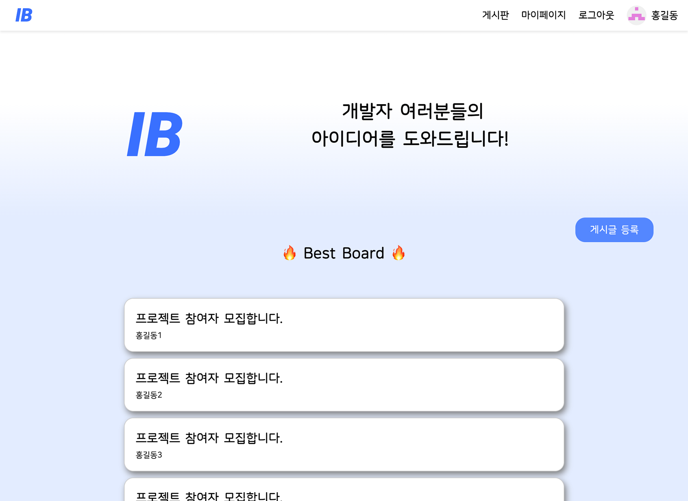

# Idea Bank

아이디어 공유 플랫폼

## Team

| 학교      | 학번       | 이름                                     | 분야                                                                                                            |
|---------|----------|----------------------------------------|---------------------------------------------------------------------------------------------------------------|
| 숙명여자대학교 |          | [김서윤](https://github.com/seoyoon04)    |  |
| 숙명여자대학교 |          | [김혜림](https://github.com/kimhyerims)   |  |
| 국민대학교   | 20233478 | [윤준현](https://github.com/yjhleo1215)   |  |
| 국민대학교   | 20203160 | [한준교](https://github.com/Ready-Bridge) |    |
| 국민대학교   | 20243156 | [손대현](https://github.com/son-daehyeon) |    |

## Tech Stack

### Frontend

### Backend

## [Design (Figma)](https://www.figma.com/design/BYimKnzT2lAOvFhaVWlKId/Untitled?node-id=0-1&node-type=canvas&t=UrebB2I5LlHzAQDj-0)

## Features

- 아이디어 공유하기
- 아이디어 매칭 요청하기
- 아이디어 피드백(댓글) 하기

## [Presentation](/presentation/README.md)

## Screenshots

